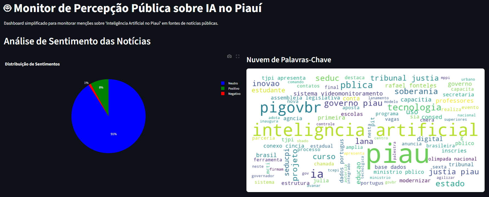

# Case: Monitoramento de Percepção Pública sobre IA no Piauí

Este projeto é uma solução para o case técnico proposto pela Secretaria de Inteligência Artificial do Estado do Piauí. O objetivo é criar um dashboard simplificado para monitorar notícias sobre "Inteligência Artificial no Piauí", realizando análise de sentimento e identificando temas recorrentes.

**[>> Link para o Dashboard Funcional <<](https://marcio-robert.github.io/case_sia_pi/)**



## Funcionalidades

* **Coleta Automatizada de Dados:** O script `coleta_noticias.py` busca as notícias mais recentes do feed do Google Notícias usando `requests` e processa o XML resultante.
* **Processamento e Análise de Sentimento:** Os títulos das notícias são limpos (com remoção de *stopwords* via NLTK) e classificados como "Positivo", "Negativo" ou "Neutro" através de um método baseado em regras.
* **Dashboard Interativo:** Uma aplicação em Streamlit (`dashboard.py`) que exibe:
    * Um gráfico de pizza com a distribuição dos sentimentos.
    * Uma nuvem de palavras com os termos mais frequentes.
    * Uma tabela interativa com os detalhes e links clicáveis para as notícias.

## Como Executar o Projeto

### Pré-requisitos

* Python 3.9+ instalado
* Acesso a um terminal (como o PowerShell ou o terminal do VS Code)

### Passos para Instalação e Execução

1.  **Clone o repositório:**
    ```bash
    git clone [https://marcio-casesiapi.streamlit.app/](https://marcio-casesiapi.streamlit.app/)
    cd case_sia_pi
    ```

2.  **Crie e ative um ambiente virtual:**
    ```bash
    python -m venv venv
    .\venv\Scripts\activate
    ```

3.  **Instale as dependências:**
    ```bash
    pip install -r requirements.txt
    ```

4.  **Execute o script de coleta de dados:**
    ```bash
    python coleta_noticias.py
    ```
    Isso irá gerar o arquivo `noticias.csv`.

5.  **Execute o dashboard Streamlit:**
    ```bash
    streamlit run dashboard.py
    ```
    A aplicação será aberta automaticamente no seu navegador.

## Estrutura do Projeto

* `coleta_noticias.py`: Script para coleta de dados do Google Notícias.
* `dashboard.py`: Script principal da aplicação Streamlit.
* `requirements.txt`: Lista de dependências do projeto.
* `DECISIONS.md`: Documentação das escolhas técnicas.
* `.gitignore`: Arquivo para ignorar arquivos desnecessários.
* `noticias.csv`: Arquivo gerado com os dados coletados.

## Ferramentas Utilizadas

* **Linguagem:** Python
* **Bibliotecas Principais:** Pandas, Streamlit, Requests, NLTK, WordCloud, Plotly.
* **Versionamento:** Git e GitHub

## Transparência no Uso de IA

Partes do código boilerplate, a estruturação inicial dos scripts e a otimização de funções foram desenvolvidos em colaboração com o Google Gemini, que atuou como um "parceiro de programação". A lógica principal para atender aos requisitos do case, os refinamentos, os testes e a elaboração desta documentação foram de minha autoria.